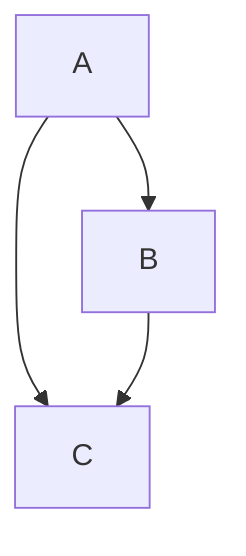

# Graphs

## Directed

A directed graph is a graph that is unidirectional in this the edges have a specific direction and the edges have directions specified with them also a directed graph can contain cycles.

## Undirected

An undirected graph is a graph where the edges do not have a specific direction and it is bidirectional in nature it does not have a parent-child relation concept as there is no particular direction.

